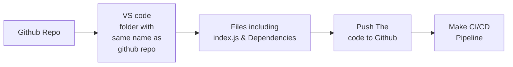

# TASK 1: Automate Code Deployment Using CI/CD Pipeline (GitHub Actions)

## Softwares & Tools Installed to achieve the task

- Installed VSCode
- Installed Node
- Installed Git
- Installed Docker
- Created sample index.js file
- Installed dependencies
- NPM
- NPM Express

## Workflow That I followed

