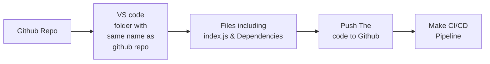

# TASK 1: Automate Code Deployment Using CI/CD Pipeline (GitHub Actions)

## Softwares & Tools Installed to achieve the task

- Installed VSCode
- Installed Node
- Installed Git
- Installed Docker
- Created sample index.js file
- Installed dependencies
- NPM
- NPM Express

## Workflow That I followed

## Issues faced While Completing The Task

- While Running the index.js file i got an error as express was not installed 
- Creating main.yml file took help of google and chatgpt
- .github/workflows i forgot to add dot (.) run failed
- Github Secrets for username and tokens with only read rights (run failed) created again with all permissions
- While pushing the files to repo got an error as git was not properly initialized and authenticated
